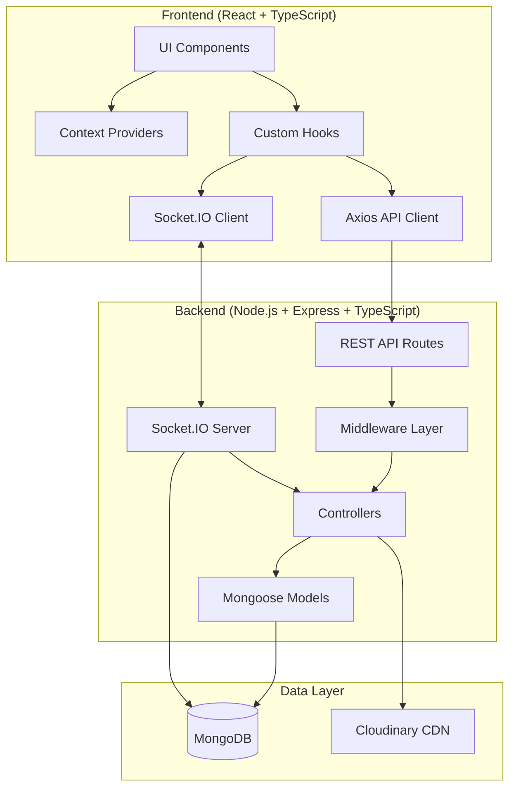

# Design Document: TalkSpace Feature Expansion

## Overview

This design extends the existing TalkSpace full-stack messaging application with 11 new feature sets while maintaining backward compatibility and respecting existing architecture patterns. TalkSpace currently provides 1-to-1 messaging with Socket.IO real-time communication, JWT authentication, MongoDB persistence, and Cloudinary media storage.

### Design Philosophy

- **Extension over redesign**: Extend existing models and infrastructure rather than creating parallel systems
- **Consistency**: Match existing TypeScript/Express/React patterns, naming conventions, and code organization
- **Real-time first**: Use Socket.IO for all state changes that affect multiple users
- **Backend authority**: Backend enforces all privacy, permissions, and data integrity rules
- **Progressive enhancement**: Each feature works independently and integrates seamlessly

### Existing Architecture Context

**Backend Stack:**
- Node.js + Express + TypeScript
- MongoDB with Mongoose ODM
- Socket.IO for real-time events
- JWT authentication (access + refresh tokens)
- Cloudinary for media storage
- Rate limiting middleware

**Frontend Stack:**
- React 18 + TypeScript
- Custom hooks and context patterns
- Axios for HTTP requests
- Socket.IO client

**Existing Models:**
- `User`: Authentication, profile, friends list, blocked users, online status
- `Message`: 1-to-1 chat with reactions, replies, status, deletion tracking
- `FriendRequest`: Friend connection lifecycle
- `Notification`: System notifications for friend activities

**Existing Socket Events:**
- Connection/authentication via JWT cookie
- `user-online`/`user-offline`: Presence updates
- `typing`: Typing indicators
- `new-message`: Message delivery
- `message-deleted`: Message deletion sync
- `message-reaction`: Emoji reaction sync
- `messages-read`: Read receipt sync
- Call events: `call-user`, `answer-call`, `reject-call`, `end-call`, `ice-candidate`

## Architecture

### High-Level Architecture



### Component Integration Strategy

All new features integrate with existing systems:

1. **Model Extensions**: Add fields to existing `User` and `Message` models where logical
2. **New Models**: Create dedicated models for domain-specific entities (GroupChat, StatusUpdate, PrivacySettings)
3. **Socket Events**: Extend existing socket handler in `src/socket.ts` with new event types
4. **API Routes**: Add new route files following existing pattern (`src/routes/`)
5. **Controllers**: Create feature-specific controllers (`src/controllers/groups/`, `src/controllers/status/`, etc.)
6. **Frontend Contexts**: Add new context providers for group, status, and settings state management
7. **UI Components**: Build feature components following existing component structure

## Components and Interfaces

### Database Schema Design

#### New Model: GroupChat

**File**: `backend/src/models/groupChat.model.ts`

```typescript
import mongoose, { Schema, Types, Document } from "mongoose";

export interface IGroupMessage {
  senderId: Types.ObjectId;
  text?: string;
  file?: string;
  mimeType?: string;
  reactions: Array<{ emoji: string; userId: Types.ObjectId }>;
  isDeleted: boolean;
  deletedFor: string[];
  replyTo?: Types.ObjectId;
  clientId?: string;
  status: "sending" | "sent" | "delivered" | "read" | "failed";
  isEdited: boolean;
  editedAt?: Date;
  editHistory: Array<{ originalText: string; editedAt: Date }>;
  createdAt: Date;
  updatedAt: Date;
}

export interface IPinnedMessage {
  messageId: Types.ObjectId;
  pinnedBy: Types.ObjectId;
  pinnedAt: Date;
}

export interface IGroupChat extends Document {
  _id: Types.ObjectId;
  name: string;
  avatar?: string;
  description?: string;
  members: Types.ObjectId[];
  admins: Types.ObjectId[];
  createdBy: Types.ObjectId;
  messages: Types.DocumentArray<IGroupMessage>;
  pinnedMessages: IPinnedMessage[];
  createdAt: Date;
  updatedAt: Date;
}

const groupMessageSchema = new Schema<IGroupMessage>(
  {
    senderId: { type: Schema.Types.ObjectId, ref: "User", required: true },
    text: { type: String },
    file: { type: String },
    mimeType: { type: String },
    reactions: [
      {
        emoji: String,
        userId: { type: Schema.Types.ObjectId, ref: "User" },
      },
    ],
    isDeleted: { type: Boolean, default: false },
    deletedFor: { type: [String], default: [] },
    replyTo: { type: Schema.Types.ObjectId },
    clientId: { type: String },
    status: {
      type: String,
      enum: ["sending", "sent", "delivered", "read", "failed"],
      default: "sent",
    },
    isEdited: { type: Boolean, default: false },
    editedAt: { type: Date },
    editHistory: [
      {
        originalText: String,
        editedAt: Date,
      },
    ],
  },
  { timestamps: true }
);

const groupChatSchema = new Schema<IGroupChat>(
  {
    name: { type: String, required: true },
    avatar: { type: String },
    description: { type: String },
    members: [{ type: Schema.Types.ObjectId, ref: "User", required: true }],
    admins: [{ type: Schema.Types.ObjectId, ref: "User", required: true }],
    createdBy: { type: Schema.Types.ObjectId, ref: "User", required: true },
    messages: [groupMessageSchema],
    pinnedMessages: [
      {
        messageId: { type: Schema.Types.ObjectId, required: true },
        pinnedBy: { type: Schema.Types.ObjectId, ref: "User" },
        pinnedAt: { type: Date, default: Date.now },
      },
    ],
  },
  { timestamps: true }
);

// Indexes for performance
groupChatSchema.index({ members: 1 });
groupChatSchema.index({ "messages.createdAt": -1 });
groupChatSchema.index({ "messages.senderId": 1 });

export const GroupChat = mongoose.model<IGroupChat>("GroupChat", groupChatSchema);
```

#### New Model: StatusUpdate

**File**: `backend/src/models/statusUpdate.model.ts`

```typescript
import mongoose, { Schema, Types, Document } from "mongoose";

export interface IStatusViewer {
  userId: Types.ObjectId;
  viewedAt: Date;
}

export interface IStatusUpdate extends Document {
  _id: Types.ObjectId;
  userId: Types.ObjectId;
  contentType: "text" | "image" | "video";
  textContent?: string;
  mediaUrl?: string;
  backgroundColor?: string;
  font?: string;
  privacyMode: "all_friends" | "friends_except" | "only_share_with";
  excludedFriends: Types.ObjectId[];
  includedFriends: Types.ObjectId[];
  viewers: IStatusViewer[];
  expiryTime: Date;
  createdAt: Date;
  updatedAt: Date;
}

const statusUpdateSchema = new Schema<IStatusUpdate>(
  {
    userId: { type: Schema.Types.ObjectId, ref: "User", required: true, index: true },
    contentType: {
      type: String,
      enum: ["text", "image", "video"],
      required: true,
    },
    textContent: { type: String },
    mediaUrl: { type: String },
    backgroundColor: { type: String },
    font: { type: String },
    privacyMode: {
      type: String,
      enum: ["all_friends", "friends_except", "only_share_with"],
      default: "all_friends",
    },
    excludedFriends: [{ type: Schema.Types.ObjectId, ref: "User" }],
    includedFriends: [{ type: Schema.Types.ObjectId, ref: "User" }],
    viewers: [
      {
        userId: { type: Schema.Types.ObjectId, ref: "User" },
        viewedAt: { type: Date, default: Date.now },
      },
    ],
    expiryTime: { type: Date, required: true, index: true },
  },
  { timestamps: true }
);

// TTL index to auto-delete expired statuses
statusUpdateSchema.index({ expiryTime: 1 }, { expireAfterSeconds: 0 });

// Compound index for efficient friend status queries
statusUpdateSchema.index({ userId: 1, expiryTime: 1 });

export const StatusUpdate = mongoose.model<IStatusUpdate>("StatusUpdate", statusUpdateSchema);
```

#### New Model: PrivacySettings

**File**: `backend/src/models/privacySettings.model.ts`

```typescript
import mongoose, { Schema, Types, Document } from "mongoose";

type VisibilityLevel = "everyone" | "friends" | "nobody";

export interface IPrivacySettings extends Document {
  _id: Types.ObjectId;
  userId: Types.ObjectId;
  lastSeenVisibility: VisibilityLevel;
  onlineStatusVisibility: VisibilityLevel;
  profilePhotoVisibility: VisibilityLevel;
  statusVisibility: VisibilityLevel;
  readReceiptEnabled: boolean;
  allowMessagesFrom: "everyone" | "friends";
  allowGroupInvitesFrom: "everyone" | "friends";
  createdAt: Date;
  updatedAt: Date;
}

const privacySettingsSchema = new Schema<IPrivacySettings>(
  {
    userId: {
      type: Schema.Types.ObjectId,
      ref: "User",
      required: true,
      unique: true,
      index: true,
    },
    lastSeenVisibility: {
      type: String,
      enum: ["everyone", "friends", "nobody"],
      default: "everyone",
    },
    onlineStatusVisibility: {
      type: String,
      enum: ["everyone", "friends", "nobody"],
      default: "everyone",
    },
    profilePhotoVisibility: {
      type: String,
      enum: ["everyone", "friends", "nobody"],
      default: "everyone",
    },
    statusVisibility: {
      type: String,
      enum: ["everyone", "friends", "nobody"],
      default: "friends",
    },
    readReceiptEnabled: {
      type: Boolean,
      default: true,
    },
    allowMessagesFrom: {
      type: String,
      enum: ["everyone", "friends"],
      default: "everyone",
    },
    allowGroupInvitesFrom: {
      type: String,
      enum: ["everyone", "friends"],
      default: "everyone",
    },
  },
  { timestamps: true }
);

export const PrivacySettings = mongoose.model<IPrivacySettings>(
  "PrivacySettings",
  privacySettingsSchema
);
```

#### New Model: UserSettings

**File**: `backend/src/models/userSettings.model.ts`

```typescript
import mongoose, { Schema, Types, Document } from "mongoose";

export interface IChatCustomization {
  chatId: string;
  wallpaper?: {
    type: "preset" | "custom";
    value: string; // preset name or Cloudinary URL
  };
  theme?: {
    bubbleColorSent: string;
    bubbleColorReceived: string;
    textColorSent: string;
    textColorReceived: string;
  };
}

export interface IUserSettings extends Document {
  _id: Types.ObjectId;
  userId: Types.ObjectId;
  
  // Notification settings
  pushNotificationsEnabled: boolean;
  soundEnabled: boolean;
  vibrationEnabled: boolean;
  
  // Chat settings
  enterToSend: boolean;
  fontSize: "small" | "medium" | "large";
  autoDownloadMedia: {
    photos: boolean;
    videos: boolean;
    documents: boolean;
  };
  
  // Appearance
  theme: "light" | "dark" | "auto";
  glassmorphicIntensity: number; // 0-100
  
  // Call settings
  audioQuality: "low" | "medium" | "high";
  videoQuality: "low" | "medium" | "high";
  
  // Chat customization
  chatCustomizations: IChatCustomization[];
  
  // Storage
  mediaCacheSize: number; // bytes
  lastCacheClear?: Date;
  
  createdAt: Date;
  updatedAt: Date;
}

const userSettingsSchema = new Schema<IUserSettings>(
  {
    userId: {
      type: Schema.Types.ObjectId,
      ref: "User",
      required: true,
      unique: true,
      index: true,
    },
    pushNotificationsEnabled: { type: Boolean, default: true },
    soundEnabled: { type: Boolean, default: true },
    vibrationEnabled: { type: Boolean, default: true },
    enterToSend: { type: Boolean, default: true },
    fontSize: {
      type: String,
      enum: ["small", "medium", "large"],
      default: "medium",
    },
    autoDownloadMedia: {
      photos: { type: Boolean, default: true },
      videos: { type: Boolean, default: false },
      documents: { type: Boolean, default: false },
    },
    theme: {
      type: String,
      enum: ["light", "dark", "auto"],
      default: "auto",
    },
    glassmorphicIntensity: {
      type: Number,
      min: 0,
      max: 100,
      default: 50,
    },
    audioQuality: {
      type: String,
      enum: ["low", "medium", "high"],
      default: "medium",
    },
    videoQuality: {
      type: String,
      enum: ["low", "medium", "high"],
      default: "medium",
    },
    chatCustomizations: [
      {
        chatId: { type: String, required: true },
        wallpaper: {
          type: {
            type: String,
            enum: ["preset", "custom"],
          },
          value: String,
        },
        theme: {
          bubbleColorSent: String,
          bubbleColorReceived: String,
          textColorSent: String,
          textColorReceived: String,
        },
      },
    ],
    mediaCacheSize: { type: Number, default: 0 },
    lastCacheClear: { type: Date },
  },
  { timestamps: true }
);

export const UserSettings = mongoose.model<IUserSettings>("UserSettings", userSettingsSchema);
```

#### New Model: StickerPack

**File**: `backend/src/models/stickerPack.model.ts`

```typescript
import mongoose, { Schema, Types, Document } from "mongoose";

export interface ISticker {
  id: string;
  name: string;
  url: string;
  thumbnail: string;
}

export interface IStickerPack extends Document {
  _id: Types.ObjectId;
  name: string;
  description: string;
  thumbnail: string;
  stickers: ISticker[];
  isPremium: boolean;
  createdAt: Date;
  updatedAt: Date;
}

const stickerPackSchema = new Schema<IStickerPack>(
  {
    name: { type: String, required: true },
    description: { type: String },
    thumbnail: { type: String, required: true },
    stickers: [
      {
        id: { type: String, required: true },
        name: { type: String, required: true },
        url: { type: String, required: true },
        thumbnail: { type: String, required: true },
      },
    ],
    isPremium: { type: Boolean, default: false },
  },
  { timestamps: true }
);

export const StickerPack = mongoose.model<IStickerPack>("StickerPack", stickerPackSchema);
```

#### Extensions to Existing User Model

**File**: `backend/src/models/user.model.ts` (additions)

```typescript
// Add these fields to the existing IUser interface and userSchema:

export interface IUser extends Document {
  // ... existing fields ...
  
  // Chat management
  pinnedChats: Array<{
    chatId: string;
    chatType: "direct" | "group";
    pinnedAt: Date;
  }>;
  archivedChats: Array<{
    chatId: string;
    chatType: "direct" | "group";
    archivedAt: Date;
  }>;
  mutedChats: Array<{
    chatId: string;
    chatType: "direct" | "group";
    muteUntil: Date | null; // null = forever
  }>;
  
  // Recently used emojis for picker
  recentEmojis: string[];
}

// Add to schema:
pinnedChats: [
  {
    chatId: { type: String, required: true },
    chatType: { type: String, enum: ["direct", "group"], required: true },
    pinnedAt: { type: Date, default: Date.now },
  },
],
archivedChats: [
  {
    chatId: { type: String, required: true },
    chatType: { type: String, enum: ["direct", "group"], required: true },
    archivedAt: { type: Date, default: Date.now },
  },
],
mutedChats: [
  {
    chatId: { type: String, required: true },
    chatType: { type: String, enum: ["direct", "group"], required: true },
    muteUntil: { type: Date }, // null means muted forever
  },
],
recentEmojis: [{ type: String, maxlength: 10 }],
```

#### Extensions to Existing Message Model for Editing

**File**: `backend/src/models/message.model.ts` (additions)

```typescript
// Add these fields to the existing IMessage interface and messageSchema:

export interface IMessage extends Document {
  // ... existing fields ...
  
  // Message editing
  isEdited: boolean;
  editedAt?: Date;
  editHistory: Array<{
    originalText: string;
    editedAt: Date;
  }>;
}

// Add to schema:
isEdited: {
  type: Boolean,
  default: false,
},
editedAt: {
  type: Date,
},
editHistory: [
  {
    originalText: String,
    editedAt: Date,
  },
],
```

#### Extension to Notification Model

**File**: `backend/src/models/notification.modal.ts` (additions)

```typescript
// Add these notification types to the existing type enum:

type:
  | "FRIEND_REQUEST_INCOMING"
  | "FRIEND_REQUEST_ACCEPTED"
  | "FRIEND_REQUEST_REJECTED"
  | "FRIEND_REQUEST_CANCELLED"
  | "UNFRIENDED"
  | "GROUP_INVITE" // NEW
  | "GROUP_MEMBER_ADDED" // NEW
  | "GROUP_MEMBER_REMOVED" // NEW
  | "GROUP_ADMIN_PROMOTED" // NEW
  | "GROUP_MESSAGE_PINNED" // NEW
  | "NEW_STATUS_UPDATE"; // NEW
```

### API Endpoints Design

#### Group Chat APIs

**File**: `backend/src/routes/groupRoute.ts`

```typescript
import express from "express";
import { authMiddleware } from "../middlewares/auth.middleware";
import { upload } from "../libs/multer";
import * as groupController from "../controllers/groups/group.controller";
import { groupPermissionMiddleware } from "../middlewares/groupPermission.middleware";

const router = express.Router();

// Group management
router.post("/create", authMiddleware, upload.single("avatar"), groupController.createGroup);
router.get("/", authMiddleware, groupController.getMyGroups);
router.get("/:groupId", authMiddleware, groupPermissionMiddleware, groupController.getGroupDetails);
router.patch("/:groupId", authMiddleware, groupPermissionMiddleware, upload.single("avatar"), groupController.updateGroup);
router.delete("/:groupId/leave", authMiddleware, groupPermissionMiddleware, groupController.leaveGroup);

// Member management
router.post("/:groupId/members", authMiddleware, groupPermissionMiddleware, groupController.addMember);
router.delete("/:groupId/members/:memberId", authMiddleware, groupPermissionMiddleware, groupController.removeMember);
router.patch("/:groupId/admins/:memberId/promote", authMiddleware, groupPermissionMiddleware, groupController.promoteToAdmin);
router.patch("/:groupId/admins/:memberId/demote", authMiddleware, groupPermissionMiddleware, groupController.demoteAdmin);

// Group messaging
router.get("/:groupId/messages", authMiddleware, groupPermissionMiddleware, groupController.getGroupMessages);
router.post("/:groupId/messages", authMiddleware, groupPermissionMiddleware, upload.single("file"), groupController.sendGroupMessage);
router.delete("/:groupId/messages/:messageId", authMiddleware, groupPermissionMiddleware, groupController.deleteGroupMessage);
router.patch("/:groupId/messages/:messageId/edit", authMiddleware, groupPermissionMiddleware, groupController.editGroupMessage);
router.post("/:groupId/messages/:messageId/react", authMiddleware, groupPermissionMiddleware, groupController.reactToGroupMessage);

// Pinned messages (admin only)
router.post("/:groupId/messages/:messageId/pin", authMiddleware, groupPermissionMiddleware, groupController.pinMessage);
router.delete("/:groupId/messages/:messageId/unpin", authMiddleware, groupPermissionMiddleware, groupController.unpinMessage);
router.get("/:groupId/pinned", authMiddleware, groupPermissionMiddleware, groupController.getPinnedMessages);

export default router;
```

#### Status Update APIs

**File**: `backend/src/routes/statusRoute.ts`

```typescript
import express from "express";
import { authMiddleware } from "../middlewares/auth.middleware";
import { upload } from "../libs/multer";
import * as statusController from "../controllers/status/status.controller";
import { statusRateLimiter } from "../middlewares/rateLimiter";

const router = express.Router();

router.post("/", authMiddleware, statusRateLimiter, upload.single("media"), statusController.createStatus);
router.get("/", authMiddleware, statusController.getFriendsStatuses);
router.get("/my", authMiddleware, statusController.getMyStatuses);
router.get("/:statusId", authMiddleware, statusController.getStatusById);
router.post("/:statusId/view", authMiddleware, statusController.markStatusViewed);
router.delete("/:statusId", authMiddleware, statusController.deleteStatus);

export default router;
```

#### Privacy Settings APIs

**File**: `backend/src/routes/privacyRoute.ts`

```typescript
import express from "express";
import { authMiddleware } from "../middlewares/auth.middleware";
import * as privacyController from "../controllers/settings/privacy.controller";

const router = express.Router();

router.get("/", authMiddleware, privacyController.getPrivacySettings);
router.patch("/", authMiddleware, privacyController.updatePrivacySettings);
router.post("/block/:userId", authMiddleware, privacyController.blockUser);
router.delete("/block/:userId", authMiddleware, privacyController.unblockUser);
router.get("/blocked", authMiddleware, privacyController.getBlockedUsers);

export default router;
```

#### User Settings APIs

**File**: `backend/src/routes/settingsRoute.ts`

```typescript
import express from "express";
import { authMiddleware } from "../middlewares/auth.middleware";
import { upload } from "../libs/multer";
import * as settingsController from "../controllers/settings/settings.controller";

const router = express.Router();

router.get("/", authMiddleware, settingsController.getUserSettings);
router.patch("/", authMiddleware, settingsController.updateUserSettings);
router.post("/chat/:chatId/wallpaper", authMiddleware, upload.single("wallpaper"), settingsController.setChatWallpaper);
router.patch("/chat/:chatId/theme", authMiddleware, settingsController.setChatTheme);
router.delete("/cache", authMiddleware, settingsController.clearMediaCache);

export default router;
```

#### Contact Sync APIs

**File**: `backend/src/routes/contactRoute.ts`

```typescript
import express from "express";
import { authMiddleware } from "../middlewares/auth.middleware";
import { contactSyncLimiter } from "../middlewares/rateLimiter";
import * as contactController from "../controllers/contacts/contact.controller";

const router = express.Router();

router.post("/sync", authMiddleware, contactSyncLimiter, contactController.syncContacts);

export default router;
```

#### Chat Management APIs (Pin/Archive/Mute)

**File**: `backend/src/routes/chatManagementRoute.ts`

```typescript
import express from "express";
import { authMiddleware } from "../middlewares/auth.middleware";
import * as chatManagementController from "../controllers/chatManagement/chatManagement.controller";

const router = express.Router();

// Pin management
router.post("/pin", authMiddleware, chatManagementController.pinChat);
router.delete("/pin/:chatId", authMiddleware, chatManagementController.unpinChat);

// Archive management
router.post("/archive", authMiddleware, chatManagementController.archiveChat);
router.delete("/archive/:chatId", authMiddleware, chatManagementController.unarchiveChat);
router.get("/archived", authMiddleware, chatManagementController.getArchivedChats);

// Mute management
router.post("/mute", authMiddleware, chatManagementController.muteChat);
router.delete("/mute/:chatId", authMiddleware, chatManagementController.unmuteChat);

export default router;
```

#### Message Search APIs

**File**: `backend/src/routes/searchRoute.ts`

```typescript
import express from "express";
import { authMiddleware } from "../middlewares/auth.middleware";
import * as searchController from "../controllers/search/search.controller";

const router = express.Router();

router.get("/messages/:chatId", authMiddleware, searchController.searchMessages);
router.get("/messages/group/:groupId", authMiddleware, searchController.searchGroupMessages);

export default router;
```

#### Message Editing APIs (Extension to Existing)

**File**: `backend/src/routes/messageRoute.ts` (additions)

```typescript
// Add to existing messageRoute.ts:
router.patch("/:messageId/edit", authMiddleware, messageController.editMessage);
router.get("/:messageId/history", authMiddleware, messageController.getEditHistory);
```

#### Sticker APIs

**File**: `backend/src/routes/stickerRoute.ts`

```typescript
import express from "express";
import { authMiddleware } from "../middlewares/auth.middleware";
import * as stickerController from "../controllers/stickers/sticker.controller";

const router = express.Router();

router.get("/packs", authMiddleware, stickerController.getStickerPacks);
router.get("/packs/:packId", authMiddleware, stickerController.getStickerPackById);

export default router;
```

### Socket.IO Events Design

**File**: `backend/src/socket.ts` (extensions)

Add these new event handlers to the existing socket initialization:

```typescript
// Group chat events
socket.on("group-message", (data: { groupId: string; message: any }) => {
  // Broadcast to all group members except sender
});

socket.on("group-member-added", (data: { groupId: string; memberId: string }) => {
  // Notify all group members
});

socket.on("group-member-removed", (data: { groupId: string; memberId: string }) => {
  // Notify all group members and removed member
});

socket.on("group-admin-promoted", (data: { groupId: string; memberId: string }) => {
  // Notify all group members
});

socket.on("group-settings-updated", (data: { groupId: string; settings: any }) => {
  // Notify all group members
});

socket.on("message-pinned", (data: { groupId: string; messageId: string }) => {
  // Notify all group members
});

socket.on("message-unpinned", (data: { groupId: string; messageId: string }) => {
  // Notify all group members
});

// Status events
socket.on("status-posted", (data: { statusId: string; userId: string }) => {
  // Notify all online friends
});

socket.on("status-viewed", (data: { statusId: string; viewerId: string }) => {
  // Notify status creator
});

// Message editing events
socket.on("message-edited", (data: { messageId: string; newText: string; chatId: string }) => {
  // Notify recipient
});

// Chat management events (for multi-device sync)
socket.on("chat-pinned", (data: { chatId: string }) => {
  // Sync to other user's devices
});

socket.on("chat-archived", (data: { chatId: string }) => {
  // Sync to other user's devices
});

socket.on("chat-muted", (data: { chatId: string; muteUntil: Date }) => {
  // Sync to other user's devices
});
```

### Frontend Architecture

#### New Context Providers

**File**: `frontend/src/contexts/GroupContext.tsx`

```typescript
import React, { createContext, useContext, useState, useEffect } from "react";
import { useSocket } from "./SocketContext";
import * as groupApi from "../apis/group.api";

interface Group {
  _id: string;
  name: string;
  avatar?: string;
  members: string[];
  admins: string[];
  lastMessage?: any;
  unreadCount: number;
}

interface GroupContextType {
  groups: Group[];
  currentGroup: Group | null;
  loading: boolean;
  fetchGroups: () => Promise<void>;
  createGroup: (data: any) => Promise<void>;
  selectGroup: (groupId: string) => void;
  sendGroupMessage: (groupId: string, data: any) => Promise<void>;
  leaveGroup: (groupId: string) => Promise<void>;
}

const GroupContext = createContext<GroupContextType | undefined>(undefined);

export const GroupProvider: React.FC<{ children: React.ReactNode }> = ({ children }) => {
  const [groups, setGroups] = useState<Group[]>([]);
  const [currentGroup, setCurrentGroup] = useState<Group | null>(null);
  const [loading, setLoading] = useState(false);
  const socket = useSocket();

  useEffect(() => {
    if (!socket) return;

    socket.on("group-message", handleNewGroupMessage);
    socket.on("group-member-added", handleMemberAdded);
    socket.on("group-member-removed", handleMemberRemoved);
    socket.on("group-settings-updated", handleSettingsUpdated);

    return () => {
      socket.off("group-message", handleNewGroupMessage);
      socket.off("group-member-added", handleMemberAdded);
      socket.off("group-member-removed", handleMemberRemoved);
      socket.off("group-settings-updated", handleSettingsUpdated);
    };
  }, [socket]);

  const fetchGroups = async () => {
    setLoading(true);
    try {
      const response = await groupApi.getMyGroups();
      setGroups(response.data.groups);
    } finally {
      setLoading(false);
    }
  };

  const createGroup = async (data: any) => {
    const response = await groupApi.createGroup(data);
    setGroups((prev) => [response.data.group, ...prev]);
    return response.data.group;
  };

  const selectGroup = (groupId: string) => {
    const group = groups.find((g) => g._id === groupId);
    setCurrentGroup(group || null);
  };

  const sendGroupMessage = async (groupId: string, data: any) => {
    await groupApi.sendGroupMessage(groupId, data);
  };

  const leaveGroup = async (groupId: string) => {
    await groupApi.leaveGroup(groupId);
    setGroups((prev) => prev.filter((g) => g._id !== groupId));
    if (currentGroup?._id === groupId) {
      setCurrentGroup(null);
    }
  };

  const handleNewGroupMessage = (data: any) => {
    // Update groups list with new message
    setGroups((prev) =>
      prev.map((g) =>
        g._id === data.groupId
          ? { ...g, lastMessage: data.message, unreadCount: g.unreadCount + 1 }
          : g
      )
    );
  };

  const handleMemberAdded = (data: any) => {
    // Refresh group details
    fetchGroups();
  };

  const handleMemberRemoved = (data: any) => {
    // Refresh group details or remove group if current user was removed
    fetchGroups();
  };

  const handleSettingsUpdated = (data: any) => {
    // Update group settings in state
    setGroups((prev) =>
      prev.map((g) => (g._id === data.groupId ? { ...g, ...data.settings } : g))
    );
  };

  return (
    <GroupContext.Provider
      value={{
        groups,
        currentGroup,
        loading,
        fetchGroups,
        createGroup,
        selectGroup,
        sendGroupMessage,
        leaveGroup,
      }}
    >
      {children}
    </GroupContext.Provider>
  );
};

export const useGroup = () => {
  const context = useContext(GroupContext);
  if (!context) throw new Error("useGroup must be used within GroupProvider");
  return context;
};
```

**File**: `frontend/src/contexts/StatusContext.tsx`

```typescript
import React, { createContext, useContext, useState, useEffect } from "react";
import { useSocket } from "./SocketContext";
import * as statusApi from "../apis/status.api";

interface Status {
  _id: string;
  userId: string;
  contentType: "text" | "image" | "video";
  textContent?: string;
  mediaUrl?: string;
  viewers: Array<{ userId: string; viewedAt: Date }>;
  createdAt: Date;
  expiryTime: Date;
}

interface StatusContextType {
  friendsStatuses: Map<string, Status[]>;
  myStatuses: Status[];
  loading: boolean;
  fetchFriendsStatuses: () => Promise<void>;
  fetchMyStatuses: () => Promise<void>;
  createStatus: (data: any) => Promise<void>;
  viewStatus: (statusId: string) => Promise<void>;
  deleteStatus: (statusId: string) => Promise<void>;
}

const StatusContext = createContext<StatusContextType | undefined>(undefined);

export const StatusProvider: React.FC<{ children: React.ReactNode }> = ({ children }) => {
  const [friendsStatuses, setFriendsStatuses] = useState<Map<string, Status[]>>(new Map());
  const [myStatuses, setMyStatuses] = useState<Status[]>([]);
  const [loading, setLoading] = useState(false);
  const socket = useSocket();

  useEffect(() => {
    if (!socket) return;

    socket.on("status-posted", handleStatusPosted);
    socket.on("status-viewed", handleStatusViewed);

    return () => {
      socket.off("status-posted", handleStatusPosted);
      socket.off("status-viewed", handleStatusViewed);
    };
  }, [socket]);

  const fetchFriendsStatuses = async () => {
    setLoading(true);
    try {
      const response = await statusApi.getFriendsStatuses();
      const statusMap = new Map<string, Status[]>();
      response.data.statuses.forEach((status: Status) => {
        const userStatuses = statusMap.get(status.userId) || [];
        statusMap.set(status.userId, [...userStatuses, status]);
      });
      setFriendsStatuses(statusMap);
    } finally {
      setLoading(false);
    }
  };

  const fetchMyStatuses = async () => {
    const response = await statusApi.getMyStatuses();
    setMyStatuses(response.data.statuses);
  };

  const createStatus = async (data: any) => {
    const response = await statusApi.createStatus(data);
    setMyStatuses((prev) => [response.data.status, ...prev]);
  };

  const viewStatus = async (statusId: string) => {
    await statusApi.viewStatus(statusId);
  };

  const deleteStatus = async (statusId: string) => {
    await statusApi.deleteStatus(statusId);
    setMyStatuses((prev) => prev.filter((s) => s._id !== statusId));
  };

  const handleStatusPosted = (data: any) => {
    fetchFriendsStatuses();
  };

  const handleStatusViewed = (data: any) => {
    // Update viewer list for own status
    setMyStatuses((prev) =>
      prev.map((s) =>
        s._id === data.statusId
          ? { ...s, viewers: [...s.viewers, { userId: data.viewerId, viewedAt: new Date() }] }
          : s
      )
    );
  };

  return (
    <StatusContext.Provider
      value={{
        friendsStatuses,
        myStatuses,
        loading,
        fetchFriendsStatuses,
        fetchMyStatuses,
        createStatus,
        viewStatus,
        deleteStatus,
      }}
    >
      {children}
    </StatusContext.Provider>
  );
};

export const useStatus = () => {
  const context = useContext(StatusContext);
  if (!context) throw new Error("useStatus must be used within StatusProvider");
  return context;
};
```

**File**: `frontend/src/contexts/SettingsContext.tsx`

```typescript
import React, { createContext, useContext, useState, useEffect } from "react";
import * as settingsApi from "../apis/settings.api";
import * as privacyApi from "../apis/privacy.api";

interface UserSettings {
  theme: "light" | "dark" | "auto";
  fontSize: "small" | "medium" | "large";
  pushNotificationsEnabled: boolean;
  soundEnabled: boolean;
  enterToSend: boolean;
  // ... other settings
}

interface PrivacySettings {
  lastSeenVisibility: "everyone" | "friends" | "nobody";
  onlineStatusVisibility: "everyone" | "friends" | "nobody";
  readReceiptEnabled: boolean;
  // ... other privacy settings
}

interface SettingsContextType {
  userSettings: UserSettings | null;
  privacySettings: PrivacySettings | null;
  loading: boolean;
  fetchSettings: () => Promise<void>;
  updateUserSettings: (settings: Partial<UserSettings>) => Promise<void>;
  updatePrivacySettings: (settings: Partial<PrivacySettings>) => Promise<void>;
}

const SettingsContext = createContext<SettingsContextType | undefined>(undefined);

export const SettingsProvider: React.FC<{ children: React.ReactNode }> = ({ children }) => {
  const [userSettings, setUserSettings] = useState<UserSettings | null>(null);
  const [privacySettings, setPrivacySettings] = useState<PrivacySettings | null>(null);
  const [loading, setLoading] = useState(false);

  const fetchSettings = async () => {
    setLoading(true);
    try {
      const [userRes, privacyRes] = await Promise.all([
        settingsApi.getUserSettings(),
        privacyApi.getPrivacySettings(),
      ]);
      setUserSettings(userRes.data.settings);
      setPrivacySettings(privacyRes.data.settings);
    } finally {
      setLoading(false);
    }
  };

  const updateUserSettings = async (settings: Partial<UserSettings>) => {
    const response = await settingsApi.updateUserSettings(settings);
    setUserSettings(response.data.settings);
  };

  const updatePrivacySettings = async (settings: Partial<PrivacySettings>) => {
    const response = await privacyApi.updatePrivacySettings(settings);
    setPrivacySettings(response.data.settings);
  };

  useEffect(() => {
    fetchSettings();
  }, []);

  return (
    <SettingsContext.Provider
      value={{
        userSettings,
        privacySettings,
        loading,
        fetchSettings,
        updateUserSettings,
        updatePrivacySettings,
      }}
    >
      {children}
    </SettingsContext.Provider>
  );
};

export const useSettings = () => {
  const context = useContext(SettingsContext);
  if (!context) throw new Error("useSettings must be used within SettingsProvider");
  return context;
};
```

#### Key Frontend Components

**Group Chat Components:**
- `GroupList.tsx`: Display all groups with unread badges
- `GroupChatWindow.tsx`: Main group chat interface
- `CreateGroupModal.tsx`: Group creation flow
- `GroupDetailsPanel.tsx`: Member list, settings, media
- `GroupMemberItem.tsx`: Member with admin badge
- `PinnedMessagesPanel.tsx`: Display pinned messages

**Status Components:**
- `StatusRing.tsx`: Animated ring around avatar indicating active status
- `StatusList.tsx`: Horizontal scrollable status list
- `StatusViewer.tsx`: Fullscreen status viewer with progress bars
- `CreateStatusModal.tsx`: Status creation with text/image/video options
- `StatusViewersList.tsx`: List of users who viewed status (creator only)

**Settings Components:**
- `SettingsPage.tsx`: Main settings navigation
- `AccountSettings.tsx`: Profile edit, password change
- `PrivacySettings.tsx`: All privacy toggles
- `NotificationSettings.tsx`: Notification preferences
- `ChatSettings.tsx`: Chat behavior settings
- `AppearanceSettings.tsx`: Theme and UI customization
- `CallSettings.tsx`: Audio/video quality
- `StorageSettings.tsx`: Cache management
- `ChatCustomizationModal.tsx`: Wallpaper and theme picker

**Chat Management Components:**
- `ChatListItem.tsx`: Enhanced with pin/mute/archive badges
- `ChatContextMenu.tsx`: Pin, archive, mute, clear actions
- `ArchivedChatsPage.tsx`: View archived conversations

**Enhanced Message Components:**
- `MessageBubble.tsx`: Add "edited" indicator
- `EditMessageModal.tsx`: Inline edit UI
- `EditHistoryModal.tsx`: Show edit history
- `ReadReceiptIndicator.tsx`: Checkmark status icons
- `SearchBar.tsx`: Message search input
- `SearchResults.tsx`: Search results list

**Emoji/Sticker Components:**
- `EmojiPicker.tsx`: Enhanced picker with categories, search, recents
- `StickerPicker.tsx`: Sticker pack browser
- `StickerPackList.tsx`: Grid of sticker packs
- `StickerGrid.tsx`: Individual pack stickers

**Contact Sync Components:**
- `ContactSyncButton.tsx`: Trigger contact sync
- `ContactMatchesList.tsx`: Display found contacts
- `AddFriendFromContact.tsx`: Quick add friend action

## Data Models

### Data Flow Examples

#### Group Message Flow

```
User A sends message to Group
  ↓
Frontend: GroupChatWindow → sendGroupMessage()
  ↓
Backend API: POST /api/groups/:groupId/messages
  ↓
Controller: Validate membership → Save to GroupChat.messages array
  ↓
Socket.IO: Emit "group-message" to all members except sender
  ↓
Other members' clients receive event → Update UI
```

#### Status Creation Flow

```
User creates status
  ↓
Frontend: CreateStatusModal → createStatus()
  ↓
Backend API: POST /api/status (with media upload)
  ↓
Controller: Upload media to Cloudinary → Create StatusUpdate document → Set 24h expiry
  ↓
Socket.IO: Emit "status-posted" to all online friends
  ↓
Friends' clients receive event → Show status ring on avatar
```

#### Privacy Enforcement Flow

```
User B requests User A's profile
  ↓
Backend: GET /api/users/:id
  ↓
Controller: Fetch User A → Fetch User A's PrivacySettings
  ↓
Apply visibility filters based on relationship (friend/non-friend)
  ↓
Return filtered user object (hide avatar if profilePhotoVisibility = "nobody")
```

### Database Indexes

Critical indexes for performance:

```javascript
// GroupChat
GroupChat.index({ members: 1 });
GroupChat.index({ "messages.createdAt": -1 });
GroupChat.index({ "messages.senderId": 1 });

// StatusUpdate
StatusUpdate.index({ userId: 1, expiryTime: 1 });
StatusUpdate.index({ expiryTime: 1 }, { expireAfterSeconds: 0 }); // TTL

// Message (existing, add for search)
Message.index({ chatId: 1, text: "text" }); // Text search

// User (existing extensions)
User.index({ "pinnedChats.chatId": 1 });
User.index({ "mutedChats.chatId": 1 });

// PrivacySettings
PrivacySettings.index({ userId: 1 }, { unique: true });

// UserSettings
UserSettings.index({ userId: 1 }, { unique: true });
```

## Error Handling

### Error Handling Strategy

**Consistent Error Response Format:**

```typescript
interface ErrorResponse {
  success: false;
  msg: string;
  error?: string;
  code?: string;
}
```

**Error Categories:**

1. **Authentication Errors** (401)
   - Invalid/expired token
   - Missing authentication

2. **Authorization Errors** (403)
   - Not group admin
   - Not group member
   - Blocked user

3. **Validation Errors** (400)
   - Invalid input data
   - Missing required fields
   - File type not allowed

4. **Not Found Errors** (404)
   - Group not found
   - User not found
   - Message not found

5. **Business Logic Errors** (409)
   - Pin limit reached
   - Edit time window expired
   - User already member

6. **Server Errors** (500)
   - Database errors
   - External service failures

**Error Handling Middleware:**

```typescript
// backend/src/middlewares/errorHandler.ts
export const errorHandler = (err: any, req: Request, res: Response, next: NextFunction) => {
  console.error(err);
  
  if (err.name === "ValidationError") {
    return res.status(400).json({
      success: false,
      msg: "Validation failed",
      error: err.message,
    });
  }
  
  if (err.name === "CastError") {
    return res.status(400).json({
      success: false,
      msg: "Invalid ID format",
    });
  }
  
  return res.status(500).json({
    success: false,
    msg: "Internal server error",
  });
};
```

**Frontend Error Handling:**

```typescript
// Use try-catch in all API calls
// Display user-friendly error messages via toast notifications
// Log errors to console in development
// Implement retry logic for network failures
```

### Privacy Enforcement Points

**Backend Middleware**: `privacyEnforcementMiddleware.ts`

```typescript
export const applyPrivacyFilters = async (
  requesterId: string,
  targetUserId: string,
  targetUser: any,
  privacySettings: IPrivacySettings
) => {
  const isFriend = targetUser.friends.includes(requesterId);
  const isBlocked = targetUser.blockedUsers.includes(requesterId);
  
  if (isBlocked) {
    throw new Error("Access denied");
  }
  
  const filtered = { ...targetUser };
  
  // Apply visibility filters
  if (shouldHide(privacySettings.lastSeenVisibility, isFriend)) {
    delete filtered.lastSeen;
  }
  
  if (shouldHide(privacySettings.onlineStatusVisibility, isFriend)) {
    delete filtered.isOnline;
  }
  
  if (shouldHide(privacySettings.profilePhotoVisibility, isFriend)) {
    delete filtered.avatar;
  }
  
  return filtered;
};

const shouldHide = (visibility: string, isFriend: boolean): boolean => {
  if (visibility === "nobody") return true;
  if (visibility === "friends" && !isFriend) return true;
  return false;
};
```

## Correctness Properties

*A property is a characteristic or behavior that should hold true across all valid executions of a system—essentially, a formal statement about what the system should do. Properties serve as the bridge between human-readable specifications and machine-verifiable correctness guarantees.*

The TalkSpace feature expansion includes data serialization and parsing logic that is appropriate for property-based testing. While most features (UI components, real-time Socket.IO coordination, database operations, file uploads) are better suited for integration tests and component tests, the serialization logic for GroupChat, PrivacySettings, and StatusUpdate objects exhibits universal properties that should hold across all valid inputs.

### Property 1: GroupChat Round-Trip Serialization

*For any* valid GroupChat object, serializing to JSON, then parsing back to an object, then serializing again to JSON SHALL produce equivalent JSON output to the original serialization.

**Validates: Requirements 18.4**

**Rationale**: Round-trip idempotency is the gold standard for serialization correctness. This property ensures that no data is lost or corrupted during the serialize-parse-serialize cycle, which validates both serialization (18.1) and parsing (18.2) implicitly.

### Property 2: GroupChat Validation Rejects Invalid Data

*For any* invalid GroupChat JSON input (missing required fields, wrong data types, out-of-range values), parsing SHALL fail with a descriptive error message that identifies the validation failure.

**Validates: Requirements 18.3**

**Rationale**: Robust input validation prevents corrupted data from entering the system. Testing across many variations of invalid inputs ensures comprehensive error handling.

### Property 3: PrivacySettings Round-Trip Serialization

*For any* valid PrivacySettings object, serializing to JSON, then parsing back to an object, then serializing again to JSON SHALL produce equivalent JSON output to the original serialization.

**Validates: Requirements 19.4**

**Rationale**: Privacy settings are critical for user security. Round-trip idempotency ensures that privacy configurations are preserved exactly during transmission and storage.

### Property 4: PrivacySettings Enum Validation

*For any* PrivacySettings JSON input with invalid enum values (visibility levels not in ["everyone", "friends", "nobody"] or permission settings not in allowed values), parsing SHALL reject the input with a descriptive error message.

**Validates: Requirements 19.3**

**Rationale**: Enum validation prevents invalid privacy configurations. Testing across all possible enum combinations (valid and invalid) ensures only legitimate privacy settings are accepted.

### Property 5: StatusUpdate Round-Trip Serialization

*For any* valid StatusUpdate object, serializing to JSON, then parsing back to an object, then serializing again to JSON SHALL produce equivalent JSON output to the original serialization.

**Validates: Requirements 20.4**

**Rationale**: Status updates contain media URLs, expiry times, and viewer lists that must be preserved exactly. Round-trip idempotency prevents data corruption during API transmission.

### Property 6: StatusUpdate Content Validation

*For any* StatusUpdate JSON input with invalid content type (not in ["text", "image", "video"]) or exceeding size limits (images > 10MB, videos > 50MB), parsing SHALL reject the input with a descriptive error message.

**Validates: Requirements 20.3**

**Rationale**: Content validation prevents resource exhaustion and ensures consistent handling of different media types. Testing across various content types and sizes ensures proper enforcement of constraints.

## Testing Strategy

### Property-Based Testing Implementation

**Property-Based Testing is ONLY applicable to Requirements 18-20 (serialization/parsing).**

The model MUST implement property-based tests for the 6 correctness properties defined above using a TypeScript property-based testing library:

**Recommended Library**: [fast-check](https://github.com/dubzzz/fast-check) for TypeScript

**Test Configuration:**
- Minimum 100 iterations per property test
- Each test MUST include a comment tag referencing the design property
- Tag format: `// Feature: talkspace-feature-expansion, Property {number}: {property text}`

**Example Property Test Structure:**

```typescript
// backend/tests/properties/groupChat.property.test.ts
import fc from "fast-check";
import { serializeGroupChat, parseGroupChat } from "../../src/utils/serialization";

describe("GroupChat Serialization Properties", () => {
  // Feature: talkspace-feature-expansion, Property 1: GroupChat Round-Trip Serialization
  it("should maintain data integrity through serialize-parse-serialize round-trip", () => {
    fc.assert(
      fc.property(
        fc.record({
          name: fc.string({ minLength: 1, maxLength: 100 }),
          members: fc.array(fc.string(), { minLength: 1, maxLength: 256 }),
          admins: fc.array(fc.string(), { minLength: 1 }),
          avatar: fc.option(fc.webUrl()),
          description: fc.option(fc.string({ maxLength: 500 })),
        }),
        (groupChat) => {
          const json1 = serializeGroupChat(groupChat);
          const parsed = parseGroupChat(json1);
          const json2 = serializeGroupChat(parsed);
          
          expect(json2).toEqual(json1);
        }
      ),
      { numRuns: 100 }
    );
  });
});
```

**For All Other Features (Requirements 1-17):**

Property-based testing is NOT appropriate because:
- UI components, Socket.IO events, database operations, file uploads, and privacy enforcement are side-effect operations or infrastructure coordination
- These features should use integration tests, component tests, and example-based unit tests instead

### Unit Testing Approach

**Backend Unit Tests:**
- Test individual controller functions with mocked models
- Test middleware logic (authentication, permissions, privacy filters)
- Test utility functions (chat ID generation, hash functions)
- Test Socket.IO event handlers with mock socket instances

**Frontend Unit Tests:**
- Test custom hooks in isolation
- Test context providers with mock data
- Test utility functions (date formatting, validation)
- Test component logic with React Testing Library

**Example Test Structure:**

```typescript
// backend/tests/controllers/group.controller.test.ts
describe("Group Controller", () => {
  describe("createGroup", () => {
    it("should create a group with valid data", async () => {
      // Test implementation
    });
    
    it("should reject if members are not friends", async () => {
      // Test implementation
    });
    
    it("should set creator as admin", async () => {
      // Test implementation
    });
  });
});
```

### Integration Testing

**API Integration Tests:**
- Test complete request/response cycles
- Test authentication flow
- Test real-time socket events
- Test file upload to Cloudinary

**Database Integration:**
- Test model creation and queries
- Test indexes and performance
- Test TTL expiration for statuses

### End-to-End Testing

**Critical User Flows:**
1. Create group → Add members → Send message → Pin message
2. Post status → Friend views status → Status expires
3. Send message → Edit within 15 minutes → View edit history
4. Pin chat → Archive chat → Mute chat → Manage all three states
5. Sync contacts → Find matches → Send friend requests
6. Update privacy settings → Verify enforcement from another account
7. Search messages → Jump to result in conversation
8. Customize chat wallpaper → Verify persistence

**E2E Test Tools:**
- Playwright or Cypress for frontend
- Supertest for backend API testing

### Performance Testing

**Load Testing Scenarios:**
- 100+ concurrent users in a group chat
- 1000+ status updates expiring simultaneously
- Message search across 10,000+ messages
- Contact sync with 500+ contacts

**Performance Targets:**
- API response time < 200ms (p95)
- Socket message delivery < 100ms
- Message search < 500ms
- Group message broadcast to 100 members < 1s

### Security Testing

**Security Checklist:**
- [ ] Authentication bypass attempts
- [ ] Authorization boundary testing (access other users' data)
- [ ] Input validation (SQL injection, XSS, file upload exploits)
- [ ] Rate limiting effectiveness
- [ ] Privacy setting bypass attempts
- [ ] Blocked user access attempts
- [ ] JWT token manipulation
- [ ] Socket.IO authentication bypass

## Performance Considerations

### Backend Optimization

**Database Query Optimization:**
- Use projections to select only needed fields
- Implement pagination for all list endpoints
- Use aggregation pipelines for complex queries (chat list)
- Add indexes on frequently queried fields

**Caching Strategy:**
- Cache user privacy settings in Redis (expires on update)
- Cache sticker pack data (rarely changes)
- Cache friend lists (invalidate on friend add/remove)

**Message Pagination:**
```typescript
// Default: 20 messages per request
// Implement cursor-based pagination for better performance
router.get("/messages", async (req, res) => {
  const limit = parseInt(req.query.limit) || 20;
  const before = req.query.before; // Message ID cursor
  
  const query = { chatId: req.params.chatId };
  if (before) {
    const refMessage = await Message.findById(before);
    query.createdAt = { $lt: refMessage.createdAt };
  }
  
  const messages = await Message.find(query)
    .sort({ createdAt: -1 })
    .limit(limit);
  
  return res.json({ messages });
});
```

**File Upload Optimization:**
- Compress images before Cloudinary upload
- Generate thumbnails for videos
- Limit file sizes (images: 10MB, videos: 50MB, documents: 20MB)
- Use Cloudinary transformations for responsive images

### Frontend Optimization

**Component Optimization:**
- Use React.memo() for message list items
- Implement virtual scrolling for long message lists (react-window)
- Lazy load images with intersection observer
- Debounce search input (300ms)

**State Management Optimization:**
- Use useReducer for complex state (group chat)
- Memoize expensive computations with useMemo
- Optimize re-renders with useCallback

**Network Optimization:**
- Implement optimistic UI updates (show message immediately, confirm async)
- Batch socket events when sending multiple actions
- Prefetch group details when hovering over group list item
- Implement service worker for offline support

**Bundle Optimization:**
- Code split by route (lazy load settings pages)
- Tree shake unused dependencies
- Compress assets with gzip/brotli
- Use dynamic imports for heavy components (emoji picker, sticker picker)

### Real-time Optimization

**Socket.IO Scalability:**
- Use Redis adapter for horizontal scaling
- Implement room-based messaging (each group is a socket room)
- Disconnect idle sockets after 5 minutes of inactivity
- Compress socket payloads with websocket compression

**Presence Optimization:**
- Throttle online/offline broadcasts (batch every 5 seconds)
- Use exponential backoff for reconnection attempts
- Implement heartbeat to detect dead connections

### Database Scaling Considerations

**Sharding Strategy:**
- Shard GroupChat by groupId
- Shard StatusUpdate by userId
- Keep User collection on primary shard (small, frequently accessed)

**Data Archival:**
- Archive messages older than 1 year to separate collection
- Compress archived messages
- Keep index on archived data for search

**Message Search Optimization:**
- Use MongoDB Atlas Search for full-text search
- Index only recent messages (last 3 months)
- Implement search result caching

## Security and Privacy

### Authentication and Authorization

**JWT Token Strategy:**
- Access token: 15 minutes expiry
- Refresh token: 7 days expiry
- Store refresh token in httpOnly cookie
- Implement token rotation on refresh

**Authorization Middleware:**
```typescript
// Group permission middleware
export const groupPermissionMiddleware = async (req, res, next) => {
  const groupId = req.params.groupId;
  const userId = req.user.userId;
  
  const group = await GroupChat.findById(groupId);
  if (!group) return res.status(404).json({ msg: "Group not found" });
  
  const isMember = group.members.some(m => m.toString() === userId);
  if (!isMember) return res.status(403).json({ msg: "Not a member" });
  
  req.group = group;
  req.isAdmin = group.admins.some(a => a.toString() === userId);
  
  next();
};

// Admin-only actions
export const requireGroupAdmin = (req, res, next) => {
  if (!req.isAdmin) {
    return res.status(403).json({ msg: "Admin privileges required" });
  }
  next();
};
```

### Privacy Implementation

**Privacy Settings Enforcement:**

```typescript
// Apply privacy filters to user responses
export const sanitizeUser = async (user: IUser, requesterId: string) => {
  const privacySettings = await PrivacySettings.findOne({ userId: user._id });
  if (!privacySettings) return user;
  
  const isFriend = user.friends.includes(requesterId);
  const isBlocked = user.blockedUsers.includes(requesterId);
  
  if (isBlocked) return null; // Hide completely
  
  const sanitized = { ...user.toObject() };
  
  // Apply visibility rules
  if (shouldHide(privacySettings.lastSeenVisibility, isFriend)) {
    delete sanitized.lastSeen;
  }
  
  if (shouldHide(privacySettings.onlineStatusVisibility, isFriend)) {
    delete sanitized.isOnline;
  }
  
  if (shouldHide(privacySettings.profilePhotoVisibility, isFriend)) {
    sanitized.avatar = null;
  }
  
  return sanitized;
};
```

**Status Privacy Implementation:**

```typescript
// Filter statuses based on privacy settings
export const getVisibleStatuses = async (viewerId: string) => {
  const viewer = await User.findById(viewerId);
  const friendIds = viewer.friends;
  
  const statuses = await StatusUpdate.find({
    userId: { $in: friendIds },
    expiryTime: { $gt: new Date() },
  });
  
  // Apply privacy filtering
  const visible = [];
  for (const status of statuses) {
    const canView = await canViewStatus(status, viewerId);
    if (canView) visible.push(status);
  }
  
  return visible;
};

const canViewStatus = async (status: IStatusUpdate, viewerId: string) => {
  if (status.privacyMode === "all_friends") return true;
  
  if (status.privacyMode === "friends_except") {
    return !status.excludedFriends.includes(viewerId);
  }
  
  if (status.privacyMode === "only_share_with") {
    return status.includedFriends.includes(viewerId);
  }
  
  return false;
};
```

### Rate Limiting

**Enhanced Rate Limiters:**

```typescript
import rateLimit from "express-rate-limit";

// Contact sync: 3 requests per hour
export const contactSyncLimiter = rateLimit({
  windowMs: 60 * 60 * 1000,
  max: 3,
  message: "Too many contact sync attempts, please try again later",
});

// Status creation: 10 per hour
export const statusRateLimiter = rateLimit({
  windowMs: 60 * 60 * 1000,
  max: 10,
  message: "Status creation limit reached",
});

// Group creation: 5 per hour
export const groupCreationLimiter = rateLimit({
  windowMs: 60 * 60 * 1000,
  max: 5,
  message: "Group creation limit reached",
});

// Message search: 30 per minute
export const searchLimiter = rateLimit({
  windowMs: 60 * 1000,
  max: 30,
  message: "Search rate limit exceeded",
});
```

### Input Validation

**Validation Middleware:**

```typescript
import { body, param, query, validationResult } from "express-validator";

export const validateGroupCreation = [
  body("name")
    .isString()
    .trim()
    .isLength({ min: 1, max: 100 })
    .withMessage("Group name must be 1-100 characters"),
  body("members")
    .isArray({ min: 1, max: 256 })
    .withMessage("Group must have 1-256 members"),
  body("description")
    .optional()
    .isString()
    .isLength({ max: 500 })
    .withMessage("Description max 500 characters"),
  (req, res, next) => {
    const errors = validationResult(req);
    if (!errors.isEmpty()) {
      return res.status(400).json({ errors: errors.array() });
    }
    next();
  },
];

export const validateMessageEdit = [
  param("messageId").isMongoId().withMessage("Invalid message ID"),
  body("text")
    .isString()
    .trim()
    .isLength({ min: 1, max: 5000 })
    .withMessage("Message must be 1-5000 characters"),
  (req, res, next) => {
    const errors = validationResult(req);
    if (!errors.isEmpty()) {
      return res.status(400).json({ errors: errors.array() });
    }
    next();
  },
];
```

### Content Security

**File Upload Validation:**

```typescript
export const validateFileUpload = (file: Express.Multer.File): boolean => {
  const allowedTypes = [
    "image/jpeg",
    "image/png",
    "image/webp",
    "image/gif",
    "video/mp4",
    "video/quicktime",
    "application/pdf",
    "audio/webm",
    "audio/mpeg",
  ];
  
  if (!allowedTypes.includes(file.mimetype)) {
    throw new Error("File type not allowed");
  }
  
  const maxSizes = {
    image: 10 * 1024 * 1024, // 10MB
    video: 50 * 1024 * 1024, // 50MB
    audio: 5 * 1024 * 1024,  // 5MB
    document: 20 * 1024 * 1024, // 20MB
  };
  
  const type = file.mimetype.split("/")[0];
  const maxSize = maxSizes[type] || maxSizes.document;
  
  if (file.size > maxSize) {
    throw new Error("File size exceeds limit");
  }
  
  return true;
};
```

### XSS Prevention

**Frontend Sanitization:**
- Use DOMPurify for any user-generated HTML content
- Escape special characters in message text
- Validate URLs before rendering as links
- Use CSP headers to prevent inline script execution

**Backend Sanitization:**
- Strip HTML tags from text inputs
- Validate and sanitize all user inputs
- Use parameterized queries (Mongoose handles this)

## Migration and Backward Compatibility

### Migration Strategy

**Phase 1: Database Migrations**

```typescript
// migration: add-chat-management-fields.ts
export const up = async () => {
  await User.updateMany(
    {},
    {
      $set: {
        pinnedChats: [],
        archivedChats: [],
        mutedChats: [],
        recentEmojis: [],
      },
    }
  );
  
  console.log("Added chat management fields to all users");
};

// migration: add-message-edit-fields.ts
export const up = async () => {
  await Message.updateMany(
    {},
    {
      $set: {
        isEdited: false,
        editHistory: [],
      },
    }
  );
  
  console.log("Added edit fields to all messages");
};

// migration: create-default-settings.ts
export const up = async () => {
  const users = await User.find({});
  
  for (const user of users) {
    // Create default privacy settings
    await PrivacySettings.findOneAndUpdate(
      { userId: user._id },
      {
        userId: user._id,
        lastSeenVisibility: "everyone",
        onlineStatusVisibility: "everyone",
        profilePhotoVisibility: "everyone",
        statusVisibility: "friends",
        readReceiptEnabled: true,
        allowMessagesFrom: "everyone",
        allowGroupInvitesFrom: "everyone",
      },
      { upsert: true }
    );
    
    // Create default user settings
    await UserSettings.findOneAndUpdate(
      { userId: user._id },
      {
        userId: user._id,
        pushNotificationsEnabled: true,
        soundEnabled: true,
        vibrationEnabled: true,
        enterToSend: true,
        fontSize: "medium",
        theme: "auto",
        glassmorphicIntensity: 50,
        autoDownloadMedia: {
          photos: true,
          videos: false,
          documents: false,
        },
        audioQuality: "medium",
        videoQuality: "medium",
        chatCustomizations: [],
      },
      { upsert: true }
    );
  }
  
  console.log("Created default settings for all users");
};
```

**Phase 2: Backend Deployment**

1. Deploy new models and migrations
2. Run migrations to add new fields
3. Deploy new API endpoints (non-breaking additions)
4. Deploy Socket.IO event handlers (backward compatible)
5. Monitor for errors

**Phase 3: Frontend Deployment**

1. Deploy feature-flagged frontend changes
2. Gradually enable features for users
3. Monitor performance and user feedback
4. Fix issues incrementally

### Backward Compatibility Considerations

**API Versioning:**
- No breaking changes to existing endpoints
- New endpoints under `/api/groups`, `/api/status`, etc.
- Existing endpoints return same response structure

**Socket Event Compatibility:**
- New events don't affect existing event listeners
- Existing events maintain same payload structure
- Clients gracefully ignore unknown events

**Database Compatibility:**
- New fields have default values
- Existing queries continue to work
- Optional fields don't break existing code

**Frontend Compatibility:**
- Progressive enhancement: new features degrade gracefully
- Existing functionality continues to work without new features
- Feature detection for unsupported browsers

## Deployment Considerations

### Environment Variables

Add these to `.env`:

```bash
# Existing variables remain unchanged

# Contact Sync
CONTACT_SYNC_SALT=<random-salt-for-hashing>

# Sticker Packs
STICKER_CDN_URL=<cloudinary-base-url>

# Redis (for Socket.IO scaling)
REDIS_URL=redis://localhost:6379

# Rate Limiting
RATE_LIMIT_WINDOW_MS=60000
RATE_LIMIT_MAX_REQUESTS=100
```

### Docker Compose Updates

```yaml
# Add Redis service to docker-compose.yml
services:
  # ... existing services ...
  
  redis:
    image: redis:7-alpine
    ports:
      - "6379:6379"
    volumes:
      - redis-data:/data
    networks:
      - talkspace-network

volumes:
  redis-data:
```

### CI/CD Pipeline Updates

```yaml
# .github/workflows/deploy.yml additions

- name: Run database migrations
  run: |
    npm run migrate:up
    
- name: Seed sticker packs
  run: |
    npm run seed:stickers
    
- name: Clear Redis cache
  run: |
    npm run cache:clear
```

### Monitoring and Logging

**Critical Metrics to Monitor:**
- Socket.IO connection count
- Group message broadcast latency
- Status creation/expiration rate
- Message search query time
- Privacy filter execution time
- Contact sync success rate
- Redis connection status

**Logging Strategy:**
- Log all group membership changes
- Log privacy setting changes
- Log failed authorization attempts
- Log rate limit violations
- Log Socket.IO connection errors

### Rollback Plan

**Rollback Triggers:**
- Error rate > 5%
- API response time > 2x baseline
- Database connection failures
- Socket.IO disconnection rate > 10%
- User-reported critical bugs

**Rollback Procedure:**
1. Revert frontend deployment
2. Disable new API endpoints via feature flags
3. Revert Socket.IO event handlers
4. Do NOT rollback database migrations (data integrity)
5. Monitor for stabilization
6. Investigate root cause

## Appendix

### Code Organization

**Backend Structure:**
```
backend/src/
├── models/
│   ├── user.model.ts (extended)
│   ├── message.model.ts (extended)
│   ├── groupChat.model.ts (NEW)
│   ├── statusUpdate.model.ts (NEW)
│   ├── privacySettings.model.ts (NEW)
│   ├── userSettings.model.ts (NEW)
│   └── stickerPack.model.ts (NEW)
├── controllers/
│   ├── groups/
│   │   └── group.controller.ts (NEW)
│   ├── status/
│   │   └── status.controller.ts (NEW)
│   ├── settings/
│   │   ├── privacy.controller.ts (NEW)
│   │   └── settings.controller.ts (NEW)
│   ├── contacts/
│   │   └── contact.controller.ts (NEW)
│   ├── chatManagement/
│   │   └── chatManagement.controller.ts (NEW)
│   ├── search/
│   │   └── search.controller.ts (NEW)
│   ├── stickers/
│   │   └── sticker.controller.ts (NEW)
│   └── messages/
│       └── chat.controller.ts (extended)
├── routes/
│   ├── groupRoute.ts (NEW)
│   ├── statusRoute.ts (NEW)
│   ├── privacyRoute.ts (NEW)
│   ├── settingsRoute.ts (NEW)
│   ├── contactRoute.ts (NEW)
│   ├── chatManagementRoute.ts (NEW)
│   ├── searchRoute.ts (NEW)
│   ├── stickerRoute.ts (NEW)
│   └── messageRoute.ts (extended)
├── middlewares/
│   ├── groupPermission.middleware.ts (NEW)
│   ├── privacyEnforcement.middleware.ts (NEW)
│   └── rateLimiter.ts (extended)
├── utils/
│   ├── privacyFilters.ts (NEW)
│   ├── contactHash.ts (NEW)
│   └── messageSearch.ts (NEW)
└── socket.ts (extended)
```

**Frontend Structure:**
```
frontend/src/
├── contexts/
│   ├── GroupContext.tsx (NEW)
│   ├── StatusContext.tsx (NEW)
│   └── SettingsContext.tsx (NEW)
├── apis/
│   ├── group.api.ts (NEW)
│   ├── status.api.ts (NEW)
│   ├── privacy.api.ts (NEW)
│   ├── settings.api.ts (NEW)
│   ├── contact.api.ts (NEW)
│   ├── chatManagement.api.ts (NEW)
│   ├── search.api.ts (NEW)
│   └── sticker.api.ts (NEW)
├── components/
│   ├── groups/ (NEW)
│   ├── status/ (NEW)
│   ├── settings/ (NEW)
│   ├── chatManagement/ (NEW)
│   ├── search/ (NEW)
│   ├── emoji/ (NEW)
│   └── stickers/ (NEW)
├── hooks/
│   ├── useGroup.ts (NEW)
│   ├── useStatus.ts (NEW)
│   ├── useSettings.ts (NEW)
│   ├── useChatManagement.ts (NEW)
│   └── useMessageSearch.ts (NEW)
└── pages/
    ├── GroupChatPage.tsx (NEW)
    ├── StatusPage.tsx (NEW)
    └── SettingsPage.tsx (NEW)
```

### API Endpoint Summary

**Group Chat:**
- `POST /api/groups/create` - Create group
- `GET /api/groups/` - Get my groups
- `GET /api/groups/:groupId` - Get group details
- `PATCH /api/groups/:groupId` - Update group
- `DELETE /api/groups/:groupId/leave` - Leave group
- `POST /api/groups/:groupId/members` - Add member
- `DELETE /api/groups/:groupId/members/:memberId` - Remove member
- `PATCH /api/groups/:groupId/admins/:memberId/promote` - Promote admin
- `PATCH /api/groups/:groupId/admins/:memberId/demote` - Demote admin
- `GET /api/groups/:groupId/messages` - Get messages
- `POST /api/groups/:groupId/messages` - Send message
- `DELETE /api/groups/:groupId/messages/:messageId` - Delete message
- `PATCH /api/groups/:groupId/messages/:messageId/edit` - Edit message
- `POST /api/groups/:groupId/messages/:messageId/react` - React to message
- `POST /api/groups/:groupId/messages/:messageId/pin` - Pin message
- `DELETE /api/groups/:groupId/messages/:messageId/unpin` - Unpin message
- `GET /api/groups/:groupId/pinned` - Get pinned messages

**Status:**
- `POST /api/status/` - Create status
- `GET /api/status/` - Get friends' statuses
- `GET /api/status/my` - Get my statuses
- `GET /api/status/:statusId` - Get status by ID
- `POST /api/status/:statusId/view` - Mark status viewed
- `DELETE /api/status/:statusId` - Delete status

**Privacy:**
- `GET /api/privacy/` - Get privacy settings
- `PATCH /api/privacy/` - Update privacy settings
- `POST /api/privacy/block/:userId` - Block user
- `DELETE /api/privacy/block/:userId` - Unblock user
- `GET /api/privacy/blocked` - Get blocked users

**Settings:**
- `GET /api/settings/` - Get user settings
- `PATCH /api/settings/` - Update user settings
- `POST /api/settings/chat/:chatId/wallpaper` - Set chat wallpaper
- `PATCH /api/settings/chat/:chatId/theme` - Set chat theme
- `DELETE /api/settings/cache` - Clear media cache

**Contacts:**
- `POST /api/contacts/sync` - Sync contacts

**Chat Management:**
- `POST /api/chat-management/pin` - Pin chat
- `DELETE /api/chat-management/pin/:chatId` - Unpin chat
- `POST /api/chat-management/archive` - Archive chat
- `DELETE /api/chat-management/archive/:chatId` - Unarchive chat
- `GET /api/chat-management/archived` - Get archived chats
- `POST /api/chat-management/mute` - Mute chat
- `DELETE /api/chat-management/mute/:chatId` - Unmute chat

**Search:**
- `GET /api/search/messages/:chatId` - Search messages in chat
- `GET /api/search/messages/group/:groupId` - Search messages in group

**Message Editing:**
- `PATCH /api/message/:messageId/edit` - Edit message
- `GET /api/message/:messageId/history` - Get edit history

**Stickers:**
- `GET /api/stickers/packs` - Get sticker packs
- `GET /api/stickers/packs/:packId` - Get sticker pack by ID

### Socket.IO Events Summary

**Group Events:**
- `group-message` - New group message
- `group-member-added` - Member added to group
- `group-member-removed` - Member removed from group
- `group-admin-promoted` - Member promoted to admin
- `group-settings-updated` - Group settings changed
- `message-pinned` - Message pinned in group
- `message-unpinned` - Message unpinned in group

**Status Events:**
- `status-posted` - New status posted
- `status-viewed` - Status viewed by someone

**Message Events:**
- `message-edited` - Message edited
- (Existing events continue to work)

**Chat Management Events:**
- `chat-pinned` - Chat pinned
- `chat-archived` - Chat archived
- `chat-muted` - Chat muted
